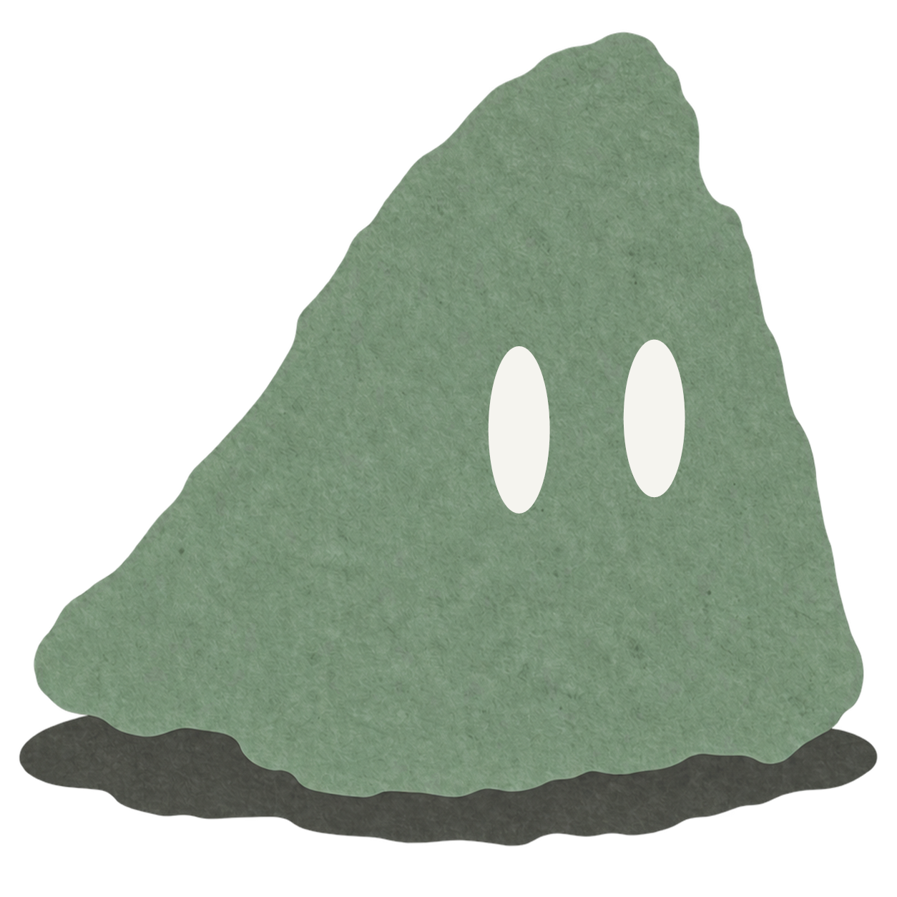

<div align="center">



# Neru <sub><sup>練る</sup></sub>

**Your AI companion on the go, and a window into the work Neru does on your computer.**

*練る (neru): to knead, to refine. Ideas get better when you work them over.*


</div>

---

## What it does

| | |
|---|---|
| 💬 **Chat with free models** | Add a free key from NVIDIA, Google, OpenRouter and others. When one model runs out, Neru moves on to the next. |
| 🖥️ **Your desktop, in your pocket** | Pair with Neru on your computer by scanning a QR code. Follow Code sessions, read diffs, approve changes and reply, end-to-end encrypted. |
| 👥 **Team, remotely** | Follow a desktop Team thread, @-mention the models on your PC and start new tasks from your phone. |
| 🌍 **Across networks** | Turn on *Connect over the internet* on the desktop to reach it from mobile data or another Wi-Fi network. |
| 🎙️ **Just say it** | Dictate with the platform speech recognizer while a sound-reactive glow listens with you. |
| 🧪 **Pocket Lab** | Download models from Google AI Edge Gallery and run them **offline** on Android with LiteRT-LM. |
| ✨ **Magic Touch** | Tap an object in a photo to cut it out, entirely on-device. |
| 🔔 **Never miss an approval** | Get notified when a desktop session is waiting on you. |

## Design

Neru follows a calm, paper-and-moss visual language in light and dark: Instrument Serif headlines, Inter for text, JetBrains Mono for code. Motion is spring-based and respects *Reduce motion*. The chat list takes after Claude's app, and message bubbles and send animations take after iMessage and Telegram.

## Getting started

**Requirements:** Node 20+, the Android SDK (or Xcode on macOS), and a device or emulator. Some features use native modules (on-device AI, speech, camera), so Neru runs as a **development build**, not in Expo Go.

```bash
npm install
npx expo run:android      # build and install the dev client (first time)
npx expo start --dev-client
```

With an Android phone on USB, `npm run phone` forwards Metro's port and starts the server.

### Useful commands

```bash
npx tsc --noEmit          # typecheck
npx expo lint             # lint
npx expo-doctor           # check dependencies and config
```

## Project layout

```
src/
├── app/            # Expo Router screens (every file is a route)
│   └── (drawer)/   # chats, desktop sessions, teams
├── components/     # screen-level building blocks (chat view, drawer, voice glow)
├── ui/             # design-system primitives (bubbles, tabs, sheets, skeletons…)
├── remote/         # encrypted pairing and protocol client for the desktop app
├── local/          # on-device models (Pocket Lab)
├── llm/            # streaming and model fallback
└── shared/         # types and protocol shared with the Neru desktop app
modules/            # local native module: on-device inference
plugins/            # Expo config plugins
```

`src/shared` mirrors the matching files in the Neru desktop app, which is why its types and protocol line up with the desktop's. Change both together.

## Privacy

API keys stay on the device in secure storage. Desktop pairing uses an end-to-end encrypted channel; the internet relay only sees ciphertext. Pocket Lab and Magic Touch run fully offline.

## Changelog

See [CHANGELOG.md](CHANGELOG.md).

<div align="center"><sub>Made with care, and kneaded until it felt right.</sub></div>
